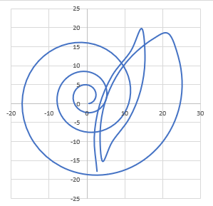
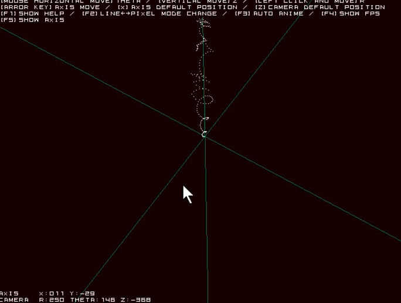

# software2-week2 homework
## 発展課題について(`my_bouncing4.c`)



## 内容
物理シミュレーションの基本構造は変えずに、三次元空間における電荷のシミュレーションにしました。電場、磁場による影響を予めテキストとして保存しておくことで、シミュレーションが回せます。`data.dat`が入力データサンプルです。シミュレーション結果は`result.csv`に保存されます。excelで開けば、二次元のグラフは容易に書くことが出来ます。三次元のグラフはexcelでは書けませんが、工夫するか、別のソフトを使えば閲覧が可能です。（ここでは[武蔵野台](https://www.vector.co.jp/soft/win95/business/se411074.html)というフリーソフトを利用しました。ちょっと使いづらいですが、最低限の粒子の動きは確認出来ます。）
- data.datの例
```
#Ex Ey Ez Bx By Bz(my_bouncing4用)
0 0 0.2 0 0 -0.5
# q x y z vx vy vz
1.0 0.0 0.0 0.0 1.0 0.0 0.0 #小さい玉
2.0 0.0 0.0 0.0 0.0 1.0 1.0 #2
```
- result.csvの例
```csv
objectnumber,q,x,y,z,vx,vy,vz,t
0,1.00,0.50,0.00,0.00,1.00,0.25,0.10,0.00
0,1.00,1.00,0.12,0.05,0.94,0.50,0.20,0.50
0,1.00,1.47,0.38,0.15,0.81,0.73,0.30,1.00
0,1.00,1.88,0.74,0.30,0.63,0.94,0.40,1.50
0,1.00,2.19,1.21,0.50,0.39,1.09,0.50,2.00
0,1.00,2.39,1.76,0.75,0.12,1.19,0.60,2.50
0,1.00,2.45,2.35,1.05,-0.18,1.22,0.70,3.00
...
```
### コンパイル
```bash
gcc -o my_bouncing4 my_bouncing4.c -lm
```
### 実行例
基本的には課題3の時と同様に`./my_bouncing4 objectnum filename`です。
```bash
./my_bouncing4 1 data.dat
```
